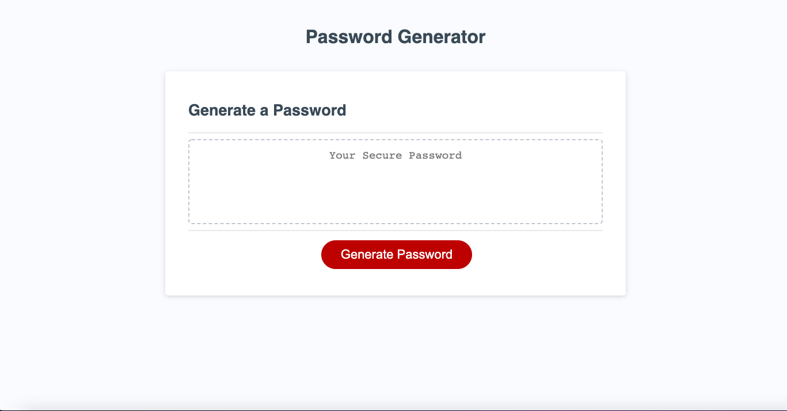

# Random Password Generator
Here is the live link and repository for my random password generator.  I have written code in JS to meet the acceptance criteria for this Challenge of creating a generator for random passwords.

## Objectives

 - When user is prompted to create a password, then a series of prompts for password criteria are offered for the user.
 - User must select at least one of the acceptance criteria for a password in order to allow generation of password
 - User MUST select least one, but can select all of the criteria needed to create a password.
 - User can only choose a password length from 8-128. If user selects a number outside these parameters, the system asks user to enter a valid amount.
 - When user answers prompts within the parameters set, then a random password will be displayed on the screen.

## Screenshot

## Live Link
https://zacharyfeltman.github.io/random-password/

